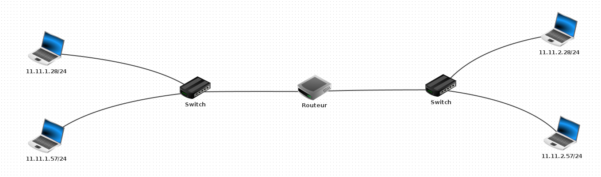

# Exercice 1 - Activité TP LAN + Ping avec Filius

## 1.

|   | 1   | 2   | 3   | 4   |
|---|-----|-----|-----|-----|
| 1 | OUI | OUI | NON | NON |
| 2 | OUI | OUI | NON | NON |
| 3 | NON | NON | OUI | OUI |
| 4 | NON | NON | OUI | OUI |

## 3.

Les mêmes ping fonctionnent et les mêmes ping ne fonctionnent pas.

Ici, le changement de netmask est inutile !

|   | 1   | 2   | 3   | 4   |
|---|-----|-----|-----|-----|
| 1 | OUI | OUI | NON | NON |
| 2 | OUI | OUI | NON | NON |
| 3 | NON | NON | OUI | OUI |
| 4 | NON | NON | OUI | OUI |

## 4.

